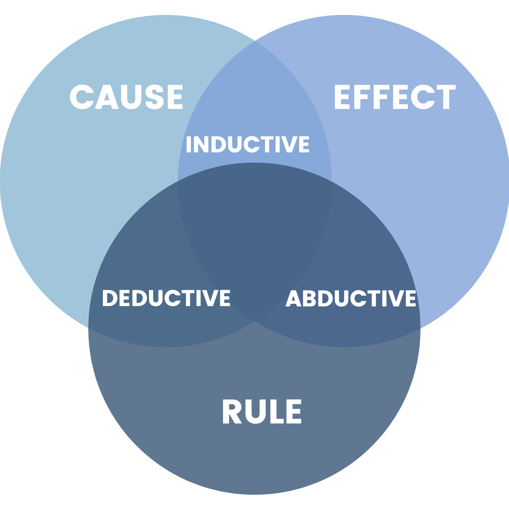

**WORK IN PROGRESS**

Advanced mathematics to me when I encounter them as an undergraduate seemed like an encyclopedia of unrelated facts and formulas and are only motivated by their use in practical applications in solving problems. 

Although practical, this view did not explain the common patterns and properties used in many different mathematics and their dependency from one another.

This led me down a rabbit hole of philosophy and foundations of mathematics which I still am exploring today. This series of posts will explore alternative views of organizing mathematics besides by applications.

# Reasoning

Instead of starting from mathematics, we begin from a more human and philosophical idea of reasoning. We can define reasoning as a process that helps to discover new truths[1]. It can also be a process to justify our beliefs and verify them. Let us explore some of the main forms of reasoning.

The forms of reasoning we will explore are composed of three elements: rule, cause, effect[2]. The rule is the explaination as to why when a cause happens, the effect follows. Given two of the three components we can derive the third.

*Notice how this definition of the forms of reasoning themselves is a form of reasoning as well? Heres a hint, the intersections are the rule, and the base circles are the cause.*

When it comes to mathematics, it is a form of deductive reasoning. We start with some assumptions which we call axioms and deduce its consequences.

# Computation

Deductive reasoning can also be seen as a process of verifying the effect given the rules and causes. Thus it can be seen as a decidable problem where given an effect and deductive system, the problem is to answer a yes or no if the effect is derivable from the system.

- oracle: prover, verifier
- formal language
    - alphabet
    - formulas
    - well formed formulas
- computational complexity classes
    - chomsky hierarchy
- formalist philosophy
- mathematics as computation

# Deductive Systems
- as a reasoning process / computation
- judgements
- axioms
- deductive rules

# First Order Logic
- introduction and elimination rules
- conjunction
- disjunction
- negation
    - constructivism / intuitionistic logic

# ZFC Axioms with choice
- axiom ...

# Conclusion
- we will use the empty set to build all of known mathematics

# References
- [1](https://en.wikipedia.org/wiki/Reason)
- [2](https://www.youtube.com/watch?v=-nn3XMoPC7s)